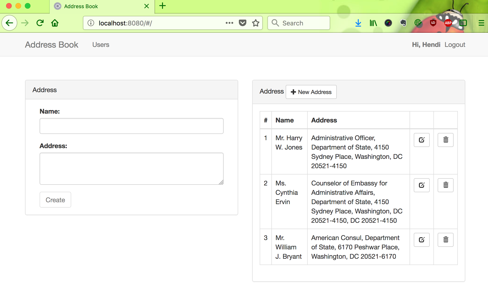
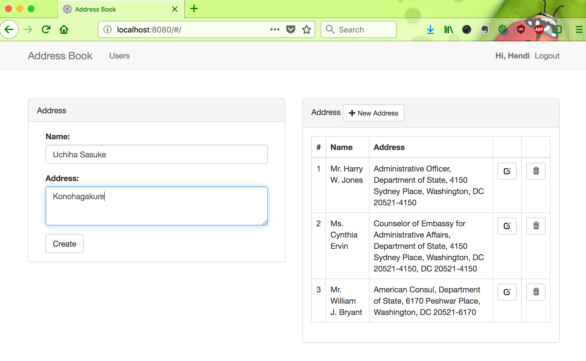
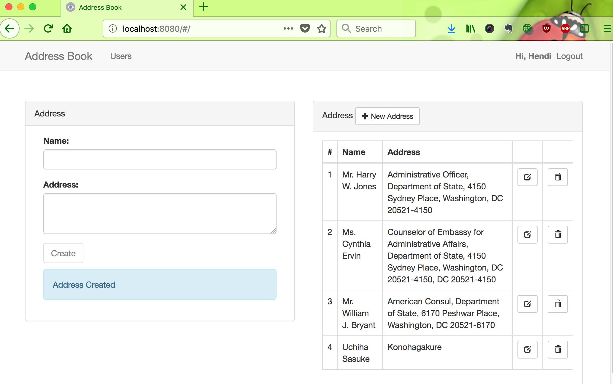

# address-book-spring-boot-security-angularjs

Sample Address Book web application with Spring Boot : Security, JPA, H2 and AngularJs. Basic authentication integrated with UI side.

Tutorials:

http://techforumist.com/address-book-application-spring-boot-basic-authentication-1/

http://techforumist.com/address-book-application-spring-boot-basic-authentication-2/

Application Demo: https://www.youtube.com/watch?v=HvtBKO_LIg0&t=25s

